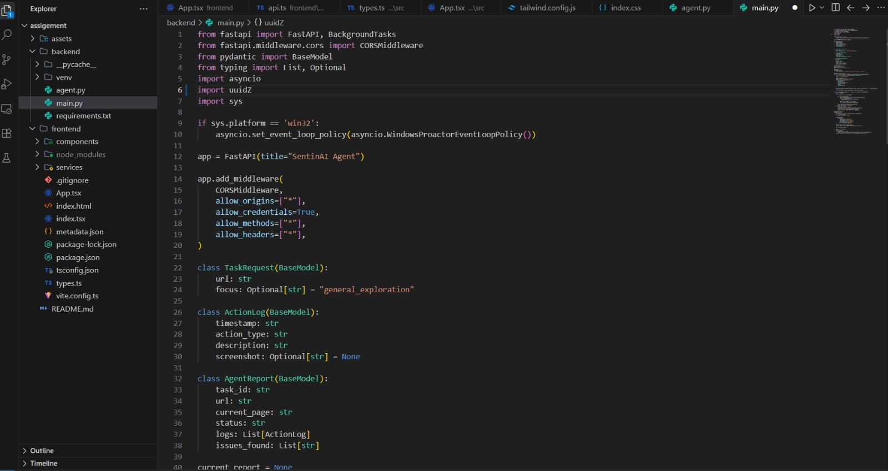
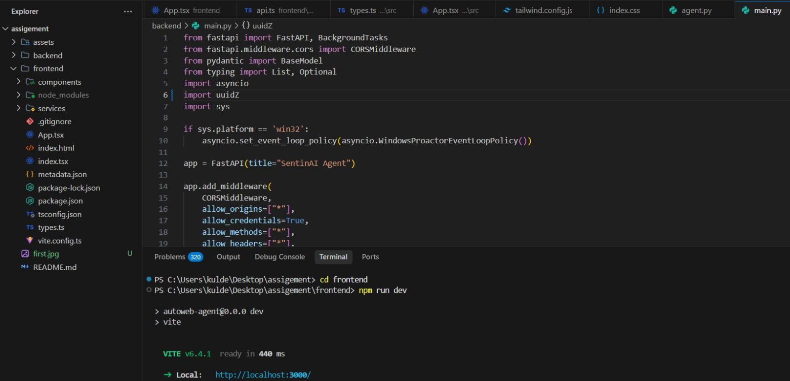
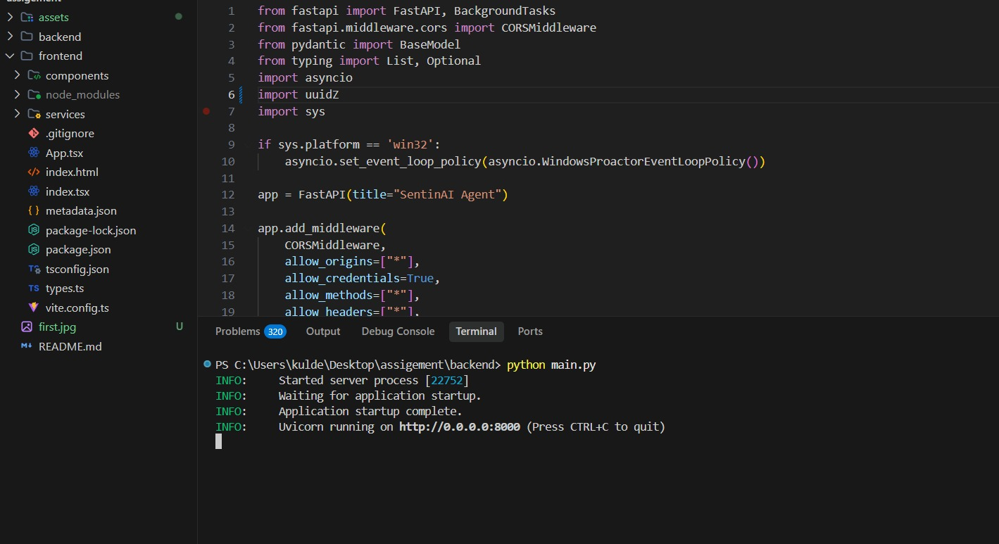
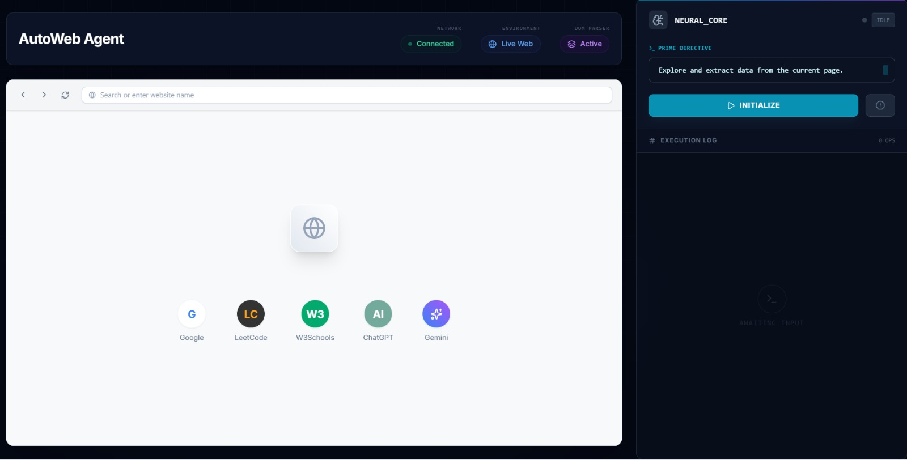
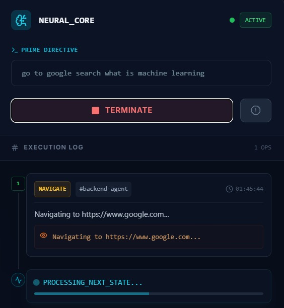
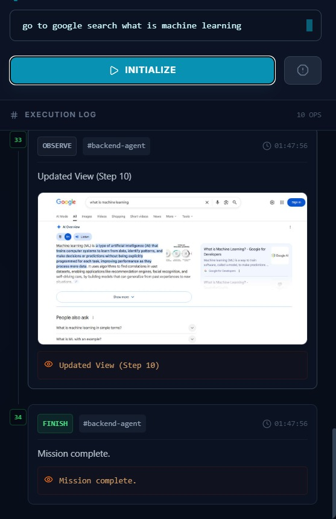
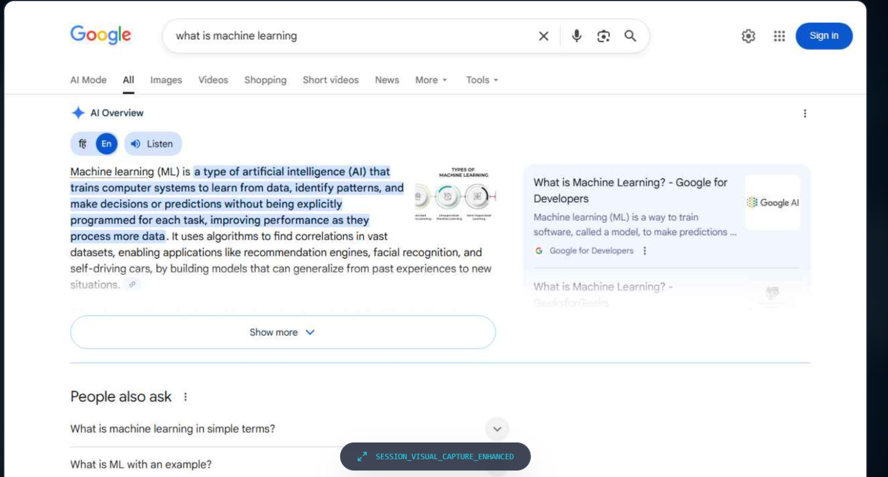

# AutoWeb Agent 🤖

An autonomous web automation system built with **FastAPI** and **React**, powered by **Playwright** for intelligent browser navigation and real-time data extraction.

## 🚀 Key Features
- **Goal-Driven Autonomy**: Enter a mission (e.g., "Search for science news") and let the agent navigate, click, and type to find answers.
- **Intelligent Data Extraction**: Automatically filters out website boilerplate (ads, headers) to present clean, readable data findings.
- **Vision-Sync Dashboard**: Real-time visual logs with screenshots of every action the agent takes.
- **High-Tech UI**: A premium mission-control interface featuring a live "Real Data" panel and inspection mode.
- **Smart Deduplication**: The agent identifies recurring patterns and only logs unique discoveries.

## 🖼️ Dashboard Visuals
You can showcase the agent in action here. To add your own screenshots, place them in the `/assets` folder and link them below:

<div align="center">
  <h3>🚀 Mission Control Gallery</h3>
  
  <br>
  
  <details>
    <summary><b>📸 View More Agent Observations (Slider)</b></summary>
    <br>
     
    <br>
     
    <br>
     
  </details>
  <br>
  <em>Interactive Autonomous Agent - Real-time Visualization</em>
</div>

## 🛠️ Project Structure
- **/frontend**: React + Vite + Tailwind/CSS frontend (Mission Control).
- **/backend**: FastAPI + Playwright backend (Agent Logic).

## 🏃 How to Run

### 1. Start the Backend
```bash
cd backend
pip install -r requirements.txt
python main.py
```

### 2. Start the Frontend
```bash
cd frontend
npm install
npm run dev
```

## 🎯 Important Points
- **Architecture**: Separated Frontend/Backend structure for scalability.
- **Filtering**: Custom noise-reduction logic in `agent.py` for "Real Data" accuracy.
- **Observability**: Top-10 high-value log filtering ensures a clean execution stream.
- **Automation**: Stealth-mode browser configuration to handle modern web environments.
